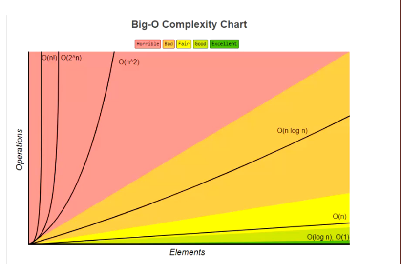

####　大O表示法
 - 常见的函数阶
  O(1)   常数(阶, 下同)
  O(log n)   对数
  O(n)       线性, 次线性
  O(nlog n)    线性对数, 或对数线性, 拟线性, 超线性
  O(n2)        平方
  

####　空间复杂度
　- 空间复杂度指的是程序运行过程中所需要的额外存储空间
   - 空间复杂度也可以用大O表示法来表示
   - 空间复杂度的计算方法与时间复杂度类似, 通常需要分析程序中需要额外分配的内存空间, 如数组, 变量, 对象, 递归调用等

#### 数组和链表的复杂度对比
 - 数组是一种连续的存储结构, 通过下标可以直接访问数组中的任意元素
  - 时间复杂度: 对于数组, 随机访问时间复杂度为O(1), 插入和删除操作时间复杂度为O(n)
  - 空间复杂度: 数组需要连续的存储空间, 空间复杂度为O(n)
 - 链表是一种链式存储结构, 通过指针连接起来的节点组成, 访问链表中元素需要从结点开始遍历
   - 时间复杂度: 对于链表, 随机访问时间复杂度为O(n), 插入和删除操作时间复杂度为O(1)
   - 空间复杂度: 链表需要为每个节点分配存储空间, 空间复杂度为O(n)
 - 在实际开发中, 选择使用数组还是链表需要根据具体场景来决定
 - 如果数据量不大, 且需要频繁随机访问元素, 使用数组可能会更好
 - 如果数据量大, 或者需要频繁插入和删除元素, 使用链表可能会更好